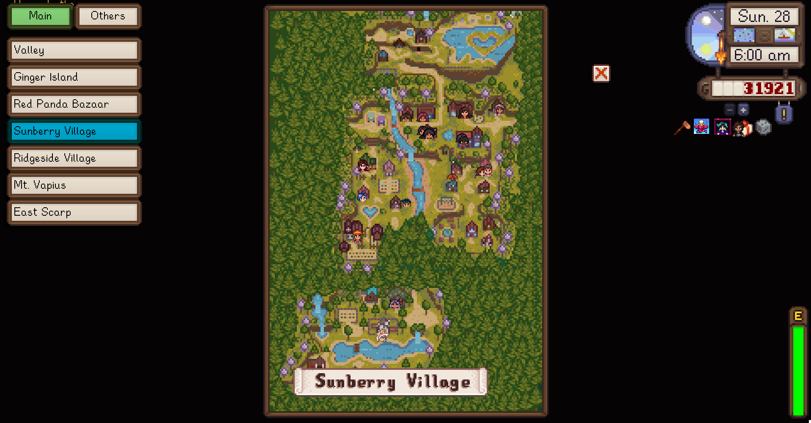

# World Atlas

This mod adds a map picker on the Map Tab of the menu or when you directly open it.
  

## How it works

1. The mod detects every location added, picking the location/position/region info directly from the game.
2. Check in data.json if the info for a certain region is added by the user, to modify it's name and visibility.
3. If the map is not in data.json, it adds the region, so the user can update the info if they want.
4. It then appears in the map.

## How to configure data.json

Example 1: The main map region of a mod. Map called "Mod.Main_Region". It would be added as
[spoiler]
Original
```
{
    "Id": "Mod.Main_Region",
    "Name": "Mod.Main_Region",
    "IsVisible": true,
    "PageNum": 0
}
```

Since it is the main map, we want to show it in the main hub, and fix it's name, becoming something like
```
{
    "Id": "Mod.Main_Region",
    "Name": "Main Region",
    "IsVisible": true,
    "PageNum": 0
}
```

Example 2: The secondary region of a mod, maybe some hunting ground or thing not always used.

Original
```
{
    "Id": "Mod.Hunting_Region",
    "Name": "Mod.Hunting_Region",
    "IsVisible": true,
    "PageNum": 0
}
```

Since it is not a main map, we might want to add it in the secondary tab and fix it's name, becoming something like

```
{
    "Id": "Mod.Hunting_Region",
    "Name": "Hunting Grounds",
    "IsVisible": true,
    "PageNum": 1
}
```

Example 3: A map added just for a moment, for a very specific quest that is never visited again.

Original
```
{
    "Id": "Mod.Quest_Alexandria",
    "Name": "Mod.Quest_Alexandria",
    "IsVisible": true,
    "PageNum": 0
}
```

Since it is not a useful map, we might just hide it. Since it's hidden we don't need to modify anything else.

```
{
    "Id": "Mod.Quest_Alexandria",
    "Name": "Mod.Quest_Alexandria",
    "IsVisible": false,
    "PageNum": 0
}
```


## Compatibility

* UI Info Suite
* Better Game Menu
* NPC Map Locations
* Every mod that adds a map (In theory, tell me if there is one that doesn't appear)
* Every mod that doesn't alter the MapPage